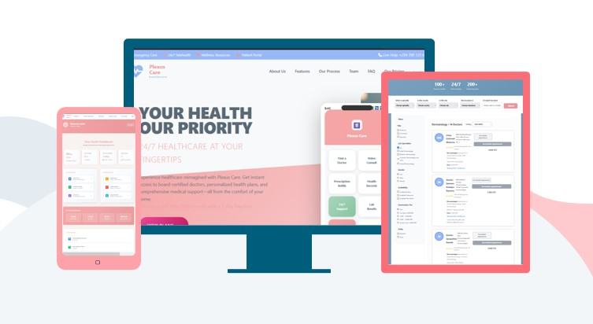
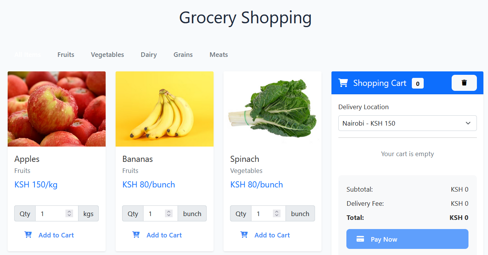
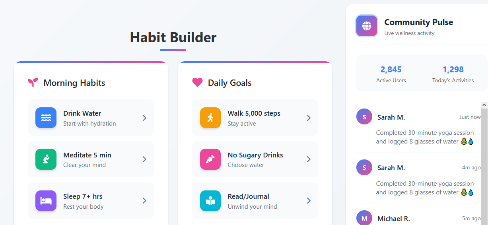
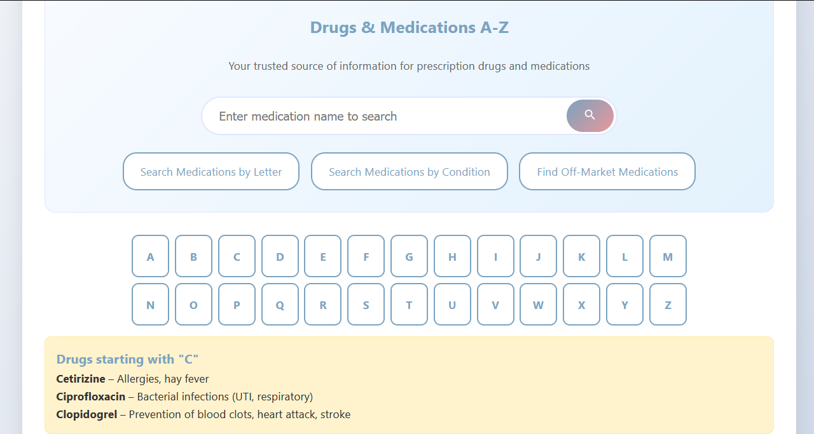
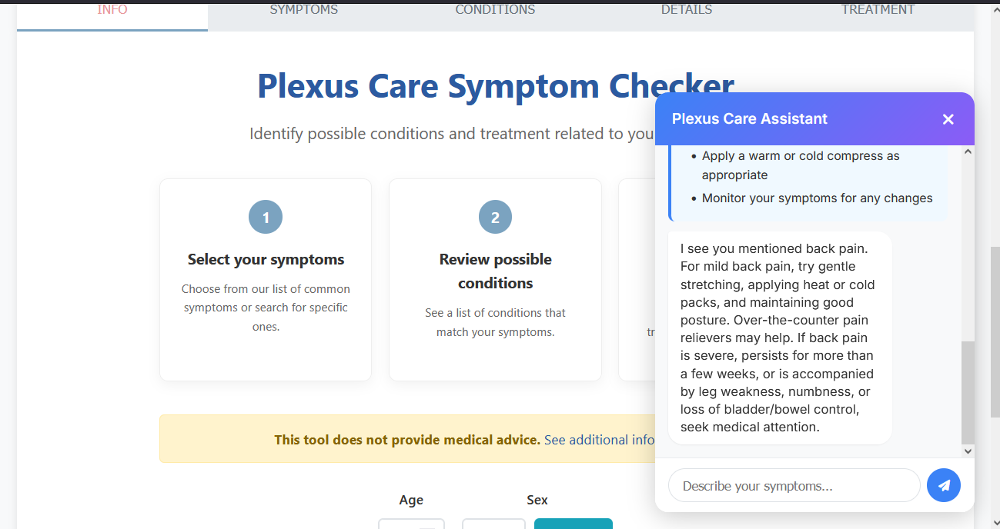

# Plexus Care - Comprehensive Healthcare Platform

[](https://opensource.org/licenses/MIT)
[](https://supabase.com/)
[](https://www.netlify.com/)

<div align="center">
  
  <p><strong>Live Demo:</strong> <a href="https://plexus-care.netlify.app/">https://plexus-care.netlify.app/</a></p>
</div>

## Table of Contents
- [Project Overview](#-project-overview)
- [Key Features](#-key-features)
- [How Plexus Care Works](#-how-plexus-care-works)
- [Technical Implementation](#-technical-implementation)
- [Getting Started](#-getting-started)
- [Project Structure](#-project-structure)
- [Symptom Checker & AI Health Assistant](#-symptom-checker--ai-health-assistant)
- [License](#-license)
- [Acknowledgments](#-acknowledgments)
- [Contact](#-contact)

## 🌟 Project Overview

Plexus Care is an all-in-one digital health companion designed to empower individuals in managing their health and wellness journey. Our platform seamlessly integrates AI-powered health tools with intuitive interfaces, making professional-grade healthcare resources accessible to everyone, everywhere.

### 🌟 Why Choose Plexus Care?
- **Smart Health Monitoring**: Track symptoms, medications, and wellness metrics in one place
- **Personalized Nutrition**: Get customized meal plans based on your unique dietary needs
- **AI-Powered Insights**: Receive intelligent health recommendations and early warnings
- **Seamless Integration**: Connect with healthcare providers and share your health data securely
- **User-Centric Design**: Intuitive interfaces for users of all technical abilities

Whether you're managing chronic conditions, pursuing wellness goals, or simply taking a proactive approach to your health, Plexus Care provides the tools and insights you need to make informed decisions about your wellbeing.

## 🚀 Key Features

### 🍽️ Smart Meal Planning
- Dietary profile setup with personalized nutrition goals
- Customized weekly meal plans with portion adjustments
- Auto-generated shopping lists with budget tracking
- Comprehensive nutrition tracking and insights

### 🌿 Wellness Tracking
- Daily wellness check-ins for mood, energy, and stress
- Sleep quality and physical activity monitoring
- AI-powered analysis of wellness trends
- Community challenges and progress tracking

### 💊 Medication Management
- AI-powered pill identification from photos
- Custom medication schedules with reminders
- Complete medication history and interaction alerts
- Emergency health information access

### 🤖 AI Health Assistant
- Chat-based symptom assessment
- Intelligent health recommendations
- Symptom pattern tracking and alerts
- Professional care guidance

## 🧠 How Plexus Care Works

### 🍽️ Smart Meal Planning Journey
<div align="center">
  
</div>

1. **Dietary Profile Setup**
   - Complete a brief questionnaire about your dietary preferences
   - Specify any allergies, restrictions, or health conditions
   - Set personalized nutrition goals (weight loss, muscle gain, maintenance)

2. **Personalized Meal Plans**
   - Receive customized weekly meal plans
   - Adjust portion sizes based on your needs
   - Swap recipes while maintaining nutritional balance

3. **Grocery Shopping Made Easy**
   - Auto-generated shopping lists organized by category
   - Local supermarket integration for price comparison
   - Budget tracking for your grocery spending

4. **Nutrition Tracking**
   - Log meals with our food database
   - Monitor macronutrients and micronutrients
   - Get insights into your eating patterns

---

### 🌿 Wellness Tracking Experience
<div align="center">
  
</div>

1. **Daily Wellness Check-in**
   - Log your mood, energy levels, and stress
   - Track sleep quality and duration
   - Monitor water intake and physical activity

2. **Personalized Insights**
   - AI-powered analysis of your wellness trends
   - Correlations between lifestyle factors and how you feel
   - Actionable recommendations for improvement

3. **Wellness Challenges**
   - Join community challenges for motivation
   - Track progress with friends and family
   - Earn rewards for healthy behaviors

---

### 💊 Medication Management System
<div align="center">
  
</div>

1. **Pill Identification**
   - Snap a photo of any medication
   - AI identifies the pill and provides detailed information
   - Get alerts for potential interactions with other medications

2. **Medication Tracking**
   - Set up custom medication schedules
   - Receive timely reminders for each dose
   - Track adherence and refill needs

3. **Health Profile**
   - Maintain a complete medication history
   - Share information with healthcare providers
   - Emergency access to critical health information

---
## 🤖 Symptom Checker & AI Health Assistant
<div align="center">
  
</div>

The Symptom Checker is a comprehensive tool that guides users through a structured health assessment process:

### Symptom Assessment Flow
1. **Information Tab**: Collect user demographics (age, gender)
2. **Symptoms Tab**: Browse and select symptoms by body area
3. **Conditions Tab**: View potential conditions matching symptoms
4. **Details Tab**: Read detailed information about selected conditions
5. **Treatment Tab**: Explore treatment options and next steps

### AI Chat Interface
The integrated AI Health Assistant provides:
- Natural language symptom description
- Intelligent response generation based on symptom keywords
- Emergency detection for critical symptoms
- Personalized self-care recommendations
- Guidance on when to seek professional help

### Symptom Database
The application includes a comprehensive symptom database organized by body areas:
- General Symptoms
- Skin Symptoms
- Head and Neck
- Chest and Abdomen
- Back and Pelvis
- Arms and Legs


## 🛠 Technical Implementation

### Technical Architecture
Plexus Care is built on a modern, scalable architecture that ensures reliability and performance:

#### Core Technologies
- **Frontend**: HTML, CSS, JavaScript with responsive design
- **Backend Services**: Supabase for database and authentication
- **AI/ML Integration**: Custom AI models for health insights
- **Email Services**: Intersend for notifications and reminders
- **Deployment**: Netlify for hosting and continuous deployment

#### Key Technical Features
- **Real-time Data Sync**: Health data is always up-to-date across devices
- **Secure Authentication**: JWT-based authentication with Supabase
- **Responsive Design**: Works on all devices and screen sizes
- **Offline Support**: Critical features available without internet connection
- **Cross-Browser Compatibility**: Supports all modern browsers

### Database Schema
The application uses Supabase PostgreSQL database with tables for:
- User profiles and preferences
- Medication records and schedules
- Symptom tracking history
- Meal plans and nutrition data
- Wellness check-in records

## 🚀 Getting Started

### Prerequisites
- Modern web browser (Chrome, Firefox, Safari, Edge)
- Internet connection for full functionality
- Email account for registration

### Using the Live Demo
1. Visit our [live demo](https://plexus-care.netlify.app/)
2. Create your free account using email registration
3. Set up your health profile through the onboarding process
4. Start exploring our health and wellness tools

### Local Development
To run Plexus Care locally:

1. Clone the repository:
```bash
git clone https://github.com/secbyteX03/Plexus-Care.git
cd Plexus-Care
```

2. Set up environment variables for Supabase:
- Create a `.env` file based on `.env.example`
- Add your Supabase URL and API key

3. Open `index.html` in your browser or use a local server:
```bash
# Using Python
python -m http.server 8000

# Using Node.js
npx serve
```

4. Access the application at `http://localhost:8000`

## 📁 Project Structure

```
Plexus-Care/
├── index.html              # Main application entry point
├── assets/                 # Static assets
│   ├── images/            # Application images and screenshots
│   └── styles/            # CSS stylesheets
├── js/                    # JavaScript modules
│   ├── config.js          # Application configuration
│   ├── symptom_checker.js # Symptom checker functionality
│   ├── symptom-checker-db.js # Symptom database
│   └── Symptom_Checker.js # Main symptom checker logic
├── components/            # Reusable UI components
└── README.md             # Project documentation
```

### Key Pages
- **Home**: Overview of all features and platform introduction
- **Dashboard**: Personalized user health dashboard
- **Drugs & Supplements**: Comprehensive medication information
- **Symptom Checker**: AI-powered health assessment tool
- **Nutrition**: Meal plans, recipes, and nutrition tracking
- **Wellness**: Health tracking and wellness tips
- **Info Resources**: Extensive health information library

## 📝 License

This project is licensed under the MIT License - see the [LICENSE](LICENSE) file for details.

## 🙏 Acknowledgments

- [Supabase](https://supabase.com/) for backend services and authentication
- [Netlify](https://www.netlify.com/) for hosting and deployment
- [Font Awesome](https://fontawesome.com/) for icons
- All open-source libraries and resources that made this project possible

## 🌍 Our Mission

Plexus Care is committed to making healthcare information accessible to everyone. Our platform provides:
- **Comprehensive Resources**: From medication information to wellness tips
- **User Empowerment**: Tools to take control of personal health
- **Evidence-Based**: Information from trusted medical sources
- **Privacy-Focused**: Your health data stays secure

### Key Differentiators
- **All-in-One Platform**: Health information, meal planning, and wellness tracking in one place
- **User-Centric Design**: Intuitive interface for all age groups
- **Regular Updates**: Continuously expanding content and features

## 📬 Contact

For inquiries, feedback, or support:
- **Email**: [faithmagret10@gmail.com](mailto:faithmagret10@gmail.com)
- **GitHub**: [https://github.com/secbyteX03/Plexus-Care](https://github.com/secbyteX03/Plexus-Care)
- **Live Demo**: [https://plexus-care.netlify.app/](https://plexus-care.netlify.app/)

---

<div align="center">
  <p>Made for better healthcare accessibility</p>
</div>