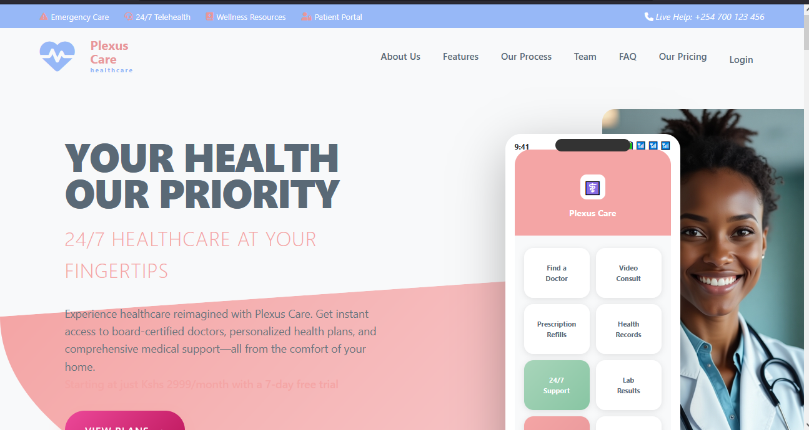

# Plexus Care - Comprehensive Healthcare Platform

  
  
<strong>Live Demo:</strong> <a href="https://plexus-care.netlify.app/">https://plexus-care.netlify.app/</a>

## 🌟 Revolutionizing Personal Healthcare

Plexus Care is an all-in-one digital health companion designed to empower individuals in managing their health and wellness journey. Our platform seamlessly integrates AI-powered health tools with intuitive interfaces, making professional-grade healthcare resources accessible to everyone, everywhere.

### 🌟 Why Choose Plexus Care?
- **Smart Health Monitoring**: Track symptoms, medications, and wellness metrics in one place
- **Personalized Nutrition**: Get customized meal plans based on your unique dietary needs
- **AI-Powered Insights**: Receive intelligent health recommendations and early warnings
- **Seamless Integration**: Connect with healthcare providers and share your health data securely
- **User-Centric Design**: Intuitive interfaces for users of all technical abilities

Whether you're managing chronic conditions, pursuing wellness goals, or simply taking a proactive approach to your health, Plexus Care provides the tools and insights you need to make informed decisions about your wellbeing.

## 🧠 How Plexus Care Works

### 🍽️ Smart Meal Planning Journey

  

1. **Dietary Profile Setup**
   - Complete a brief questionnaire about your dietary preferences
   - Specify any allergies, restrictions, or health conditions
   - Set personalized nutrition goals (weight loss, muscle gain, maintenance)

2. **Personalized Meal Plans**
   - Receive customized weekly meal plans
   - Adjust portion sizes based on your needs
   - Swap recipes while maintaining nutritional balance

3. **Grocery Shopping Made Easy**
   - Auto-generated shopping lists organized by category
   - Local supermarket integration for price comparison
   - Budget tracking for your grocery spending

4. **Nutrition Tracking**
   - Log meals with our food database
   - Monitor macronutrients and micronutrients
   - Get insights into your eating patterns

---

### 🌿 Wellness Tracking Experience

  

1. **Daily Wellness Check-in**
   - Log your mood, energy levels, and stress
   - Track sleep quality and duration
   - Monitor water intake and physical activity

2. **Personalized Insights**
   - AI-powered analysis of your wellness trends
   - Correlations between lifestyle factors and how you feel
   - Actionable recommendations for improvement

3. **Wellness Challenges**
   - Join community challenges for motivation
   - Track progress with friends and family
   - Earn rewards for healthy behaviors

---

### 💊 Medication Management System

  

1. **Pill Identification**
   - Snap a photo of any medication
   - AI identifies the pill and provides detailed information
   - Get alerts for potential interactions with other medications

2. **Medication Tracking**
   - Set up custom medication schedules
   - Receive timely reminders for each dose
   - Track adherence and refill needs

3. **Health Profile**
   - Maintain a complete medication history
   - Share information with healthcare providers
   - Emergency access to critical health information

---

### 🤖 AI Health Assistant

  

1. **Symptom Assessment**
   - Chat-based interface for describing symptoms
   - AI analyzes patterns and provides guidance
   - Recommendations for self-care or professional help

2. **Health Monitoring**
   - Track symptoms over time
   - Receive alerts for concerning patterns
   - Share reports with your healthcare provider

## 🚀 Getting Started

1. Visit our [live demo](https://plexus-care.netlify.app/)
2. Create your free account
3. Set up your health profile
4. Start exploring our health and wellness tools

## 📱 Stay Connected

- [GitHub Repository](https://github.com/secbyteX03/Plexus-Care.git)
- [Report Issues](https://github.com/secbyteX03/Plexus-Care/issues)
- [Contribute](https://github.com/secbyteX03/Plexus-Care/pulls)

## 📝 License

This project is licensed under the MIT License - see the [LICENSE](LICENSE) file for details.
   - AI identifies the pill and provides detailed information
   - Get alerts for potential interactions with other medications

2. **Medication Tracking**
   - Set up custom medication schedules
   - Receive timely reminders for each dose
   - Track adherence and refill needs

3. **Health Profile**
   - Maintain a complete medication history
   - Share information with healthcare providers
   - Emergency access to critical health information

### 🤖 AI Health Assistant
1. **Symptom Assessment**
   - Chat-based interface for describing symptoms
   - AI analyzes patterns and provides guidance
   - Recommendations for self-care or professional help

2. **Health Monitoring**
   - Track symptoms over time
   - Receive alerts for concerning patterns
   - Share reports with your healthcare provider

## 🌍 Our Mission

Plexus Care is committed to making healthcare information accessible to everyone. Our platform provides:
- **Comprehensive Resources**: From medication information to wellness tips
- **User Empowerment**: Tools to take control of personal health
- **Evidence-Based**: Information from trusted medical sources
- **Privacy-Focused**: Your health data stays secure

### Key Differentiators
- **All-in-One Platform**: Health information, meal planning, and wellness tracking in one place
- **User-Centric Design**: Intuitive interface for all age groups
- **Regular Updates**: Continuously expanding content and features

## 📊 Technical Implementation

## 🛠 Technical Architecture

Plexus Care is built on a modern, scalable architecture that ensures reliability and performance:

### Core Technologies
- **Frontend**: React.js with Tailwind CSS for responsive, accessible interfaces
- **Backend**: Node.js with Express.js for robust API services
- **Database**: Supabase for secure, real-time data management
- **AI/ML**: Integration with leading AI models for health insights
- **Authentication**: Secure user management with JWT and OAuth

### Key Features
- **Real-time Data Sync**: Your health data is always up-to-date across devices
- **End-to-End Encryption**: Enterprise-grade security for your sensitive health information
- **Offline Support**: Access critical features even without an internet connection
- **Cross-Platform**: Responsive design works on all devices and screen sizes

## 🚀 Getting Started

### Live Demo
[Plexus Care Live Demo](https://plexus-care.netlify.app/)

### Local Development
1. Clone the repository
2. Install dependencies with `npm install`
3. Set up your environment variables
4. Run `npm run dev` to start the development server

### Key Pages
- **Home**: Overview of all features
- **Dashboard**: User health dashboard
- **Drugs & Supplements**: Comprehensive medication information
- **Symptom Checker**: AI-powered health assessment
- **Nutrition**: Meal plans and recipes
- **Wellness**: Health tracking and tips
- **Info Resources**: Extensive health information library

## 📝 License
This project is licensed under the MIT License - see the [LICENSE](LICENSE) file for details.

## 🙏 Acknowledgments
- [Supabase](https://supabase.com/) for the amazing backend services
- [Tailwind CSS](https://tailwindcss.com/) for the utility-first CSS framework
- [Netlify](https://www.netlify.com/) for hosting and deployment
- [Chart.js](https://www.chartjs.org/) for data visualization
- All open-source libraries and resources that made this project possible possible

## 📬 Contact
For inquiries or feedback, please contact [faithmagret10@gmail.com](mailto:faithmagret10@gmail.com)